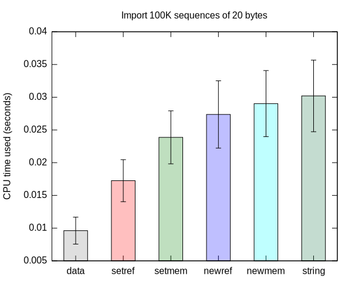
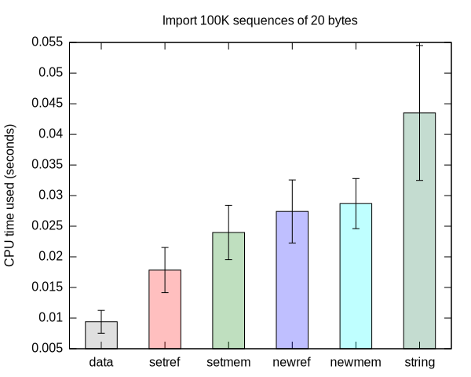
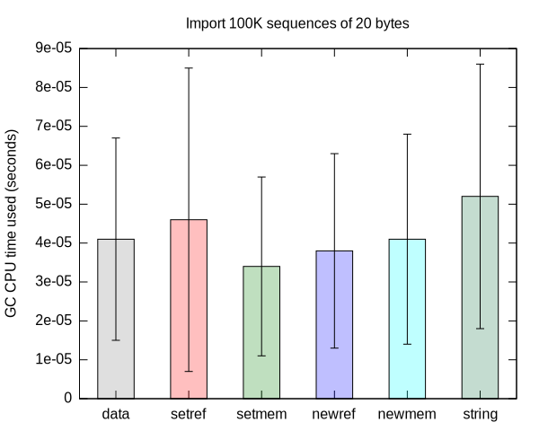
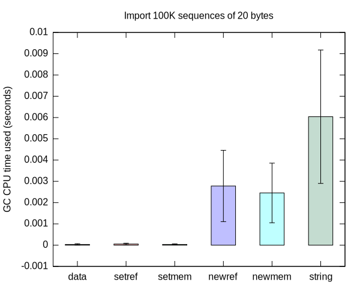
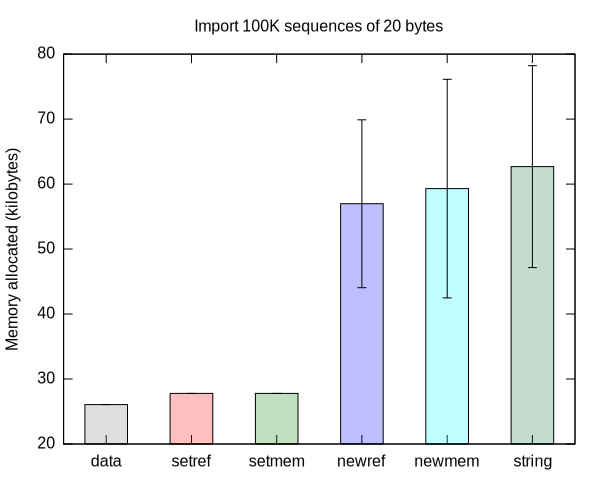
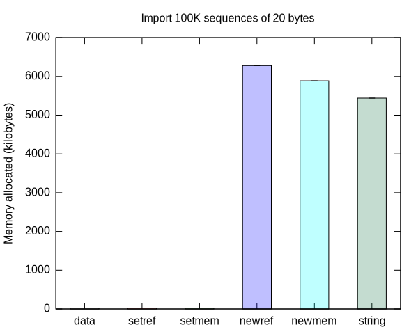
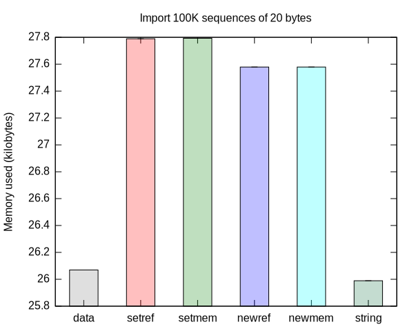
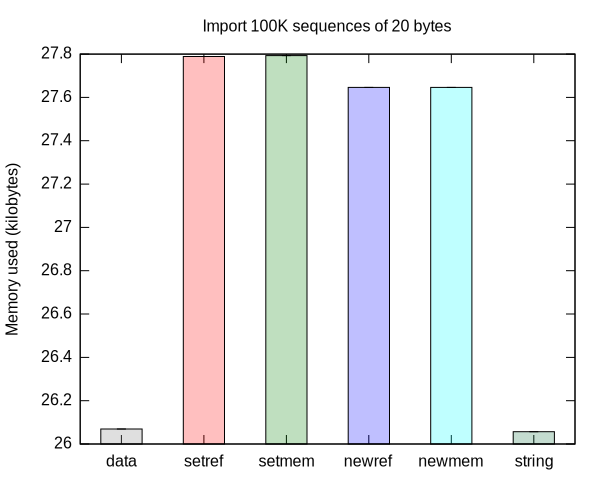

### Memory Areas

- Userdata containing a byte sequence.
- Unlike a string, its contents can be modified.
- Unlike a string, no content based hash.
	- Comparison requires content inspection.

---

### Libraries

- There are two libraries:
	- `memory.so`: Lua module.
		- `lmemmod.c`
	- `libluamemlib.so`: C library.
		- `lmemlib.h`
		- `lmemlib.c`

---

### Create a Fixed-Size Memory

```lua
zeros = memory.create(8)
assert(memory.type(zeros) == "fixed")
assert(memory.len(zeros) == 8)
assert(memory.tostring(zeros) == string.rep("\0", 8))

copy = memory.create("Hello, world!")
assert(memory.type(copy) == "fixed")
assert(memory.len(copy) == 13)
assert(memory.tostring(copy) == "Hello, world!")
```

---

### Create a Resizable Memory

```lua
resizable = memory.create()
assert(memory.type(resizable) == "resizable")
assert(memory.len(resizable) == 0)

memory.resize(resizable, 4)
assert(memory.len(resizable) == 4)
assert(memory.tostring(resizable) == "\0\0\0\0")

memory.fill(resizable, 0xff)
assert(memory.tostring(resizable) == "\xff\xff\xff\xff")
memory.resize(resizable, 8)
assert(memory.tostring(resizable) == "\xff\xff\xff\xff\0\0\0\0")

memory.resize(resizable, 6)
assert(memory.tostring(resizable) == "\xff\xff\xff\xff\0\0")
```

---

### Change Contents

```lua
eight = memory.create(8)

memory.set(eight, 1, 0x01, 0x23, 0x45, 0x67,
                     0x89, 0xab, 0xcd, 0xef)

memory.fill(eight, "Hello, world!")
assert(memory.tostring(eight) == "Hello, w")

memory.fill(eight, "Hello!", 1,  6)
memory.fill(eight,     0xff, 7, -1)
assert(memory.tostring(eight) == "Hello!\xff\xff")
```

---

### Inspect Contents

```lua
eight = memory.create("\x01\x23\x45\x67\x89\xab\xcd\xef")

assert(memory.get(eight, 8) == 0xef)

local a, b, c = memory.get(eight, 3, 5)
assert(a == 0x45)
assert(b == 0x67)
assert(c == 0x89)

assert(memory.find(eight, "\x45\x67\x89") == 3)
```

---

### Comparing Contents

```lua
m = memory.create("Hello, World!")

assert(memory.diff(m, "Hello, World!") == nil)

local diffidx, islessthan = memory.diff(m, "Hello, world!")
assert(diffidx == 8)
assert(islessthan == true)
```

---

### (Un)packing Data

```lua
m = memory.create(2)

memory.pack(m, "I2", 1, 0x0001)
if memory.unpack(m, "B") == 0 then
	print("big-endian platform")
else
	print("little-endian platform")
end
```

---

### Push External Memory

```C
static void freemalloc(lua_State *L, void *p, size_t len) {
	free(p);
}


size_t len = 8*sizeof(char);
char *p = malloc(len);
luamem_newref(L);
luamem_setref(L, -1, p, len, freemalloc);
```

---

### Push New Memory

```C
size_t len = 8*sizeof(char);

// pushes a fixed-size memory
char *p = luamem_newalloc(L, len);
memset(p, 0, len);

// pushes a resizable memory
p = luamem_realloc(L, NULL, 0, len);
memset(p, 0, len);
luamem_newref(L);
luamem_setref(L, -1, p, len, luamem_free);
```

---

### Push Temporary Memory

```C
int callwithmemory(lua_State *L, const char *name) {
	char mem[8192];

	luamem_newref(L);
	luamem_setref(L, -1, mem, sizeof(mem), NULL);

	lua_getglobal(L, name);
	lua_pushvalue(L, -2);
	int status = lua_pcall(L, 1, 0, 0);

	luamem_setref(L, -1, NULL, 0, NULL);
	lua_pop(L, 1);

	return status;
}
```

**Notes**:

- `luamem_setref` calls the current `unref` function it the `mem` pointer is different from the current one.

---

### Check Memory on Stack

```C
int luamem_isref(lua_State *L, int idx);

int luamem_ismemory (lua_State *L, int idx);

char *luamem_tomemory (lua_State *L, int idx, size_t *len);

char *luamem_checkmemory (lua_State *L, int arg, size_t *len);
```

---

### Inspect Memory on Stack

```C
size_t sz;
luamem_Unref unref;
int type;
char *p = luamem_tomemoryx(L, arg, &sz, &unref, &type);

switch (type) {
	case LUAMEM_TALLOC:
		printf("fixedsize: sz=%d p=%p\n", sz, p);
		break;
	case LUAMEM_TREF:
		if (unref == luamem_free)
			printf("resizable: sz=%d p=%p\n", sz, p);
		else
			printf("other: sz=%d p=%p unref=%p\n", sz, p, unref);
		break;
```


```C
	case LUAMEM_TNONE:
		printf("not a memory\n");
		assert(p == NULL);
		assert(sz == 0);
		assert(unref == NULL);
		break;
}
```

---

### Memory as String

```C
int luamem_isstring(lua_State *L, int idx);

const char *luamem_tostring (lua_State *L, int idx, size_t *len);

const char *luamem_checkstring (lua_State *L, int arg,
                                              size_t *len);

void luamem_addvalue (luaL_Buffer *B);

void luamem_pushresult (luaL_Buffer *B);

void luamem_pushresbufsize (luaL_Buffer *B, size_t sz);
```

**Notes**:

-  Unlike Lua strings, memory areas are not followed by a null byte (`'\0'`).

---

### Library Example

```C
#ifndef DISABLE_LUAMEMORY
#include <lmemlib.h>
#else
#define luamem_checkstring luaL_checklstring
#endif

/* ... */

int lmem_isnull (lua_State *L) {
	size_t sz;
	const char *data = luamem_checkstring(L, 1, &sz);
	lua_pushboolean(L, memchr(data, 0, sz));
	return 1.
}
```


```C
int lmem_setnull (lua_State *L) {
	size_t sz;
	char *data = luamem_checkmemory(L, 1, &sz);
	memset(data, 0, sz);
	return 0;
}
```

---

### Performance Measure

```C
// setref
luamem_setref(L, 1, buf, bufsz, NULL);
// setmem
char *p = luamem_tomemory(L, 1, NULL);
memcpy(p, buf, bufsz);
// newref
luamem_newref(L);
luamem_setref(L, 1, buf, bufsz, NULL);
// newmem
char *p = luamem_newalloc(L, bufsz);
memcpy(p, buf, bufsz);
// string
lua_pushlstring(L, buf, bufsz);
```

---

### CPU Usage
#### (GC on)




### CPU Usage
#### (GC off)




### GC CPU Usage
#### (GC on)




### GC CPU Usage
#### (GC off)



---

### Memory Allocated
#### (GC on)




### Memory Allocated
#### (GC off)




### Memory Used
#### (GC on)




### Memory Used
#### (GC off)



---

### Data Layout (experimental)

```lua
ipv4hdr = layout.struct{
	{ key="version"    , type="number",  bits=4,  endian="big" },
	{ key="ihl"        , type="number",  bits=4,  endian="big" },
	{ key="dscp"       , type="number",  bits=6,  endian="big" },
	{ key="ecn"        , type="number",  bits=2,  endian="big" },
	{ key="totallength", type="number",  bytes=2, endian="big" },
	{ key="ident"      , type="number",  bytes=2, endian="big" },
	{ key="flagnull"   , type="boolean", bits=1,  endian="big" },
	{ key="flagdf"     , type="boolean", bits=1,  endian="big" },
	{ key="flagmf"     , type="boolean", bits=1,  endian="big" },
	{ key="fragoffset" , type="number",  bits=13, endian="big" },
	{ key="timetolive" , type="number",  bytes=1               },
	{ key="protocol"   , type="number",  bytes=1               },
```


```lua
	{ key="checksum"   , type="number",  bytes=2, endian="big" },
	{ key="source"     , type="struct",
		{ key="a"        , type="number",  bytes=1 },
		{ key="b"        , type="number",  bytes=1 },
		{ key="c"        , type="number",  bytes=1 },
		{ key="d"        , type="number",  bytes=1 },
	},
	{ key="destination", type="struct",
		{ key="a"        , type="number",  bytes=1 },
		{ key="b"        , type="number",  bytes=1 },
		{ key="c"        , type="number",  bytes=1 },
		{ key="d"        , type="number",  bytes=1 },
	},
}
```

---

### Data Pointer (experimental)

```lua
p = layout.newpointer(ipv4hdr)
layout.setpointer(p, memory.create(576))

p.version = 4
p.ihl = 5
p.dscp = 0
p.ecn = 0
p.totallength = memory.len(m)
p.ident = 1024

p.flagnull = false
p.flagdf = false
p.flagmf = false
```


```lua
p.fragoffset = 0
p.timetolive = 20
p.protocol = 0x11

p.source.a = 192
p.source.b = 168
p.source.c = 0
p.source.d = 10

p.destination = p.source -- bytes are copied
p.destination.d = 1

p.checksum = calcchecksum(m)
```

---

### Questions?

#### The End